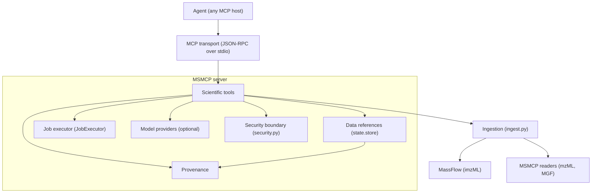

# MSMCP v1.0 architecture

This document describes what MSMCP v1.0 is, what it is not, and how the pieces
fit together. It is the reference for deciding whether a change belongs in
v1.0, in an optional capability, or outside the project for now.

## The product in one sentence

MSMCP is a **reliable MCP interface to mass-spectrometry data, spectral
libraries and scientific computation**: an agent can ingest real MS data,
search it against a local spectral library, compute over it, pass large
datasets between operations without pushing them through the conversation, and
get results it can trace back to their inputs.

## Layer diagram



The dependency rule that keeps this tractable: **tools depend on interfaces,
never on mechanisms.** Tools call `JobExecutor`, not `asyncio`. Tools call
`ingest.resolve_source`, not MassFlow. Tools carry `Provenance`, not log
lines. Only `ingest.py` knows which library parses which format.

## Scope

### Deployment posture

MSMCP runs **onsite, offline and self-contained**. It is a single local process
speaking stdio, launched by the MCP host with the user's own credentials. It
makes no network calls, needs no credentials or API keys, and depends on no
hosted service, daemon or database; its test suite is hermetic for the same
reason. This is a design constraint rather than a description of the current
milestone — see *Security and limits*.

### Direction: local MS database connectivity

The forward focus of this repository is **connectivity to mass-spectrometry
databases held on disk**: read a spectral library the user already has, in a
format they already have it in, and let an agent search it. That is what
`search_library` exists to do, and closing that gap is the primary v1.1
deliverable (see *Known limitations*).

The shape is a provider interface, mirroring `SpectralEmbedder` and
`JobExecutor` — the third use of the same pattern:

```python
class LibraryProvider(ABC):
    def describe(self) -> LibraryInfo    # name, format, version, n_spectra, digest
    def iter_spectra(self, chunk_size) -> Iterator[LibrarySpectrum]


def get_library_provider(path) -> LibraryProvider  # registry, like get_embedder
```

Planned implementations, in order: **MGF** (reusing `mgf.py`), **MSP** (the
NIST text interchange format most libraries ship as), then a local **SQLite**
peak store. Each is selected from `search_library`'s `database_file` argument,
and `provenance.SourceRef` records which library, format and version answered a
query — the reproducibility requirement that a hit table be traceable.

Constraints that follow from the offline posture:

* Library files go through the **same** security boundary as acquisitions —
  allowed root, size limit, and no write access.
* MSMCP ships **no library data** and downloads none. Commercial libraries
  (NIST, METLIN, mzCloud) are licensed per seat; the user supplies the file.
* No credentials, no rate limits and no cache layer, because there is no remote
  service to talk to.

### Core v1.0

| Capability | Where | Notes |
|---|---|---|
| MassFlow-backed ingestion | `massflow_io.py`, `ingest.py` | imzML imaging data, via MassFlow's own reader |
| MSMCP-owned readers | `mzml.py`, `mgf.py` | formats MassFlow does not cover |
| Core scientific tools | `tools/chem.py`, `tools/similarity.py`, `tools/qc.py`, `tools/io.py` | exact mass, isotopes, ppm validation, cosine, QC |
| Server-side data references | `state/pointers.py`, `state/store.py` | payloads never cross MCP/JSON |
| Provenance / reproducibility | `provenance.py` | structured, immutable, JSON-safe |
| Asynchronous execution | `execution/executor.py`, `tools/search.py` | pluggable; local asyncio implementation |
| Resource and security limits | `security.py`, `state/store.py`, `execution/executor.py` | filesystem root, file size, spectrum count, reference count/bytes, job concurrency |
| Clean static analysis | `pyproject.toml` | ruff + mypy + basedpyright, no suppressions except the notebook `E402` |

### Optional capabilities

* **Foundation models** — `models/embeddings.py` (contract + deterministic
  mocks), `models/backends.py` (DreaMS, LSM-MS2). Selected through
  `MSMCP_EMBEDDING_BACKEND`; absent by default, and their absence must degrade
  to a clear error, never to a plausible-looking score.
* **RDKit cheminformatics** — the `chem` extra; without it `annotate_isotopes`
  falls back to a static table and says so.

Neither is required for the core server to start, serve, or be tested.

### Out of scope for this repository

* **Direct instrument control, hardware actuation, and the safety interlock
  layer that must precede them.** These belong to a **different project**, not
  to this one. MSMCP is a data and computation interface; the MCP application
  layer must never be the only barrier between a model and physical hardware.
  There is no safety package here and none will be added.
* **Remote or hosted database adapters.** APIs such as MassBank, GNPS, METLIN
  or mzCloud would require network access, credentials and rate limiting, and
  would break the offline posture above. Database connectivity in this
  repository means **local files**.

### Future extension (not v1.0)

* **Durable / distributed execution.** `JobExecutor` is the seam. Prefect,
  a process pool or a job queue can be added as another implementation.
  Nothing in v1.0 may depend on one.

## Data references

The problem: a single LC–MS/MS run has more peaks than fit in any context
window, and the agent must be able to reason *about* that data without holding
it.

The abstraction is a `DataReference`: a compact, opaque handle to data that
stays on the server.

```
ptr:spectrum:9f3c1a...      # kind + opaque id
```

* **Opaque identifier.** Generated from `secrets.token_hex`. Never a Python
  `id()`, never a memory address, never a path. Stable for the reference's
  lifetime, never reused after release.
* **Metadata, not payload.** A reference carries its kind, shape, byte size,
  creation/expiry times, namespace and provenance. `to_dict()` is what a tool
  returns; it cannot contain the payload.
* **Immutable payloads.** Registration validates the payload against its kind
  and takes one defensive copy with read-only buffers, so neither the caller
  nor a later reader can mutate stored data in place.
* **Bounded.** `MSMCP_MAX_REFERENCES` and `MSMCP_MAX_TOTAL_BYTES` are enforced
  by refusing new registrations, never by silently evicting live data — a
  resource error must not become a wrong answer.
* **Expiring and releasable.** `MSMCP_REFERENCE_TTL_SECONDS` (default one hour)
  expires references lazily on access; `release_reference` frees them
  immediately. Release is idempotent.
* **Isolated.** The store partitions references by namespace. The stdio server
  uses a single namespace because it serves one local session; the mechanism
  exists so a future multi-session transport can partition without touching
  tool code.

### What is *not* claimed

MSMCP does **not** claim zero-copy. Registration copies once, deliberately, to
guarantee immutability. The property that is actually guaranteed, and tested,
is that **the payload is never serialised through MCP/JSON** — a 100,000-peak
spectrum reaches the model as a ~300-character JSON object.

PyArrow is not used: it is not a dependency, and NumPy is already the
project's array representation. There is no Arrow-shaped hole to fill.

## Ingestion

```
file -> ingest.resolve_source -> (MassFlow | msmcp reader) -> Spectrum -> DataReference
```

`ingest.resolve_source` chooses the reader from the file extension and records
which one it picked, because that choice belongs in provenance.

| Format | Reader | Why |
|---|---|---|
| `.mzML`, `.mzML.gz` | `msmcp.mzml` | MassFlow 0.1.x ships no mzML reader |
| `.mgf`, `.mgf.gz` | `msmcp.mgf` | MassFlow ships no MGF reader |
| `.imzML` (+ `.ibd`) | MassFlow `MSDataManagerImzML` | genuinely supported by MassFlow |
| `.raw`, `.d`, `.wiff`, `.mzXML` | refused | recognised, with conversion guidance |

All readers converge on one type, `msmcp.mzml.Spectrum`, so downstream tools
never branch on format. `Spectrum.coordinate` is populated only for imaging
sources.

### MassFlow integration

MassFlow is used, not wrapped speculatively: MSMCP calls
`MSDataManagerImzML` and converts the spectra it produces. Two documented
consequences:

1. **MassFlow reconfigures the root logger on import.** Its logger module
   removes every root handler and installs a `StreamHandler(sys.stdout)`. On
   the stdio transport that corrupts JSON-RPC framing. `massflow_io` repoints
   those handlers at stderr immediately after import, and a test asserts that
   no log handler in the process writes to stdout after a read.
2. **MassFlow creates a `logs/` directory** in the process working directory.
   This is library behaviour that MSMCP cannot suppress; the directory is
   gitignored and called out in the README rather than hidden.

MassFlow reading must never fabricate data. A payload that cannot be read is
reported as a `MalformedFileError`; in particular, an acquisition in which
*every* spectrum comes back empty is treated as a read failure, because real
imaging data can contain empty pixels but not an entirely empty run.

## Provenance

`provenance.py` defines immutable, JSON-safe records. Every derived object a
tool returns can answer: which operation, which parameters, which source files
(with format, reader backend and — for files up to 64 MiB — a SHA-256 digest),
which parent references, which software versions, and which model and
checkpoint if a model ran.

It is deliberately not a provenance framework: no graph, no query language, no
storage. A record travels with the result it describes and is embedded in the
`DataReference`s registered alongside it. Parents are stored as plain
identifier strings so that `provenance` has no dependency on the reference
store — the store depends on provenance, not the reverse.

## Execution

```
tools/call -> JobExecutor.submit -> (job_id) -> poll -> result | failure | cancellation
```

`JobExecutor` is the interface: `submit`, `status`, `result`, `cancel`,
`forget`, `list_jobs`, `shutdown`. `LocalAsyncExecutor` is the v1.0
implementation — CPU-bound work on worker threads of the server's own event
loop, bounded by a semaphore, with a TTL on finished records. Prefect is
deliberately not a dependency; the interface is what makes it an option later.

Cancellation semantics are explicit: a worker thread cannot be interrupted, so
cancelling marks the job terminal and **discards** its output. A caller that
sees `cancelled` never sees partial results.

## MCP Tasks: what is implemented and what is not

Statuses use the MCP vocabulary (`mcp.types.TaskStatus`), and
`JobStatusSnapshot.to_task_dict()` renders a snapshot into the shape of an MCP
`Task` (`task_id`, `status`, `status_message`, `created_at`,
`last_updated_at`, `ttl`, `poll_interval`).

**The installed SDK does not dispatch Tasks.** `mcp` 2.1.1 defines the Tasks
types but documents them as types-only: `tasks/get`, `tasks/result` and
`tasks/cancel` are absent from the request unions, so a server cannot answer
them regardless of what it implements. MSMCP therefore exposes the same
semantics through its own polling tool (`check_search_status`) and keeps the
wire representation aligned with the specification.

The alternative — inventing an application-level task protocol — would be
incompatible with the spec, and is deliberately not done. When the transport
dispatches Tasks, the mapping is mechanical rather than a redesign.

## Security and limits

Every limit is enforced at one place and refuses rather than degrades.

| Boundary | Enforced in | Knob |
|---|---|---|
| Filesystem root (symlinks resolved) | `security.resolve_path` | `MSMCP_ALLOWED_ROOT` |
| Per-file size | `security.validate_file_size` | `MSMCP_MAX_FILE_SIZE_BYTES` |
| Spectra per request | `security.validate_spectrum_count` | `MSMCP_MAX_SPECTRA` |
| Live references | `state.pointers.PointerStore` | `MSMCP_MAX_REFERENCES` |
| Reference bytes | `state.pointers.PointerStore` | `MSMCP_MAX_TOTAL_BYTES` |
| Reference lifetime | `state.pointers.PointerStore` | `MSMCP_REFERENCE_TTL_SECONDS` |
| Concurrent jobs | `execution.executor.LocalAsyncExecutor` | constructor |

MSMCP is a local, single-user server on the stdio transport. It must not be
exposed as a network service: anyone who can drive the host LLM can drive the
server, with the server's own credentials.

## Failure philosophy

A recurring theme in the code, and the reason several tools changed shape
during the v1.0 work:

* Parser failures are reported, never converted into plausible scientific
  output (`MalformedFileError`, `InaccessiblePathError`,
  `UnsupportedFormatError`, `MissingDependencyError`).
* Synthetic or incomplete results are labelled in the result itself, not only
  in documentation.
* Absence is visible: an unhashed source file reports `digest: null` rather
  than omitting the field; an unknown MS level is `null`, not a guess.

## Known limitations (v1.0)

1. **No spectral-library reader.** `search_library` scans a synthetic
   in-memory library seeded from the database path string. The query spectrum
   is real data; the library is not, and the report says so. This is the
   largest gap, it is the repository's stated forward focus, and it is the
   first v1.1 deliverable — see *Direction: local MS database connectivity*.
2. **Job state is in-process.** It does not survive a restart; the poller
   reports a lost job as failed rather than pending, so a client can never spin
   forever.
3. **MSMCP owns its mzML and MGF readers.** That is a deliberate consequence of
   MassFlow 0.1.x being imaging-only, not an architectural preference.
4. **MS-Numpress-compressed mzML arrays** require the optional `pynumpress`
   package and report a missing-dependency error without it.
5. **MassFlow materialises one placeholder per pixel** when loading an imzML
   acquisition, so whole-slide images are bounded by MassFlow's own behaviour.
6. **The eval notebook is the slowest artefact** to run (`make eval`, ~15 s).

## Acceptance criteria for v1.0

The release is complete when the repository demonstrates all of the following:

- [x] Real, MassFlow-backed ingestion for imzML, plus MSMCP readers for mzML and MGF
- [x] Robust scientific tool execution with deterministic tests for core calculations
- [x] Server-side `DataReference`s for large payloads, with no payload serialisation
- [x] Consistent result representations (structured metadata + references + provenance)
- [x] Provenance retained and verifiable across a multi-step workflow
- [x] Bounded resource usage (store limits, job concurrency, file and spectrum caps)
- [x] Security / path isolation, including symlink escape and paired-file checks
- [x] MCP-compatible task semantics, with the SDK's Tasks limitation documented
- [x] Clean failure and cancellation semantics
- [x] Clean `ruff`, `mypy` and `basedpyright` runs with no source suppressions
- [x] End-to-end integration coverage, including failure and cancellation paths
- [x] Documented supported formats and capabilities

DreaMS and LSM-MS2 are **not** release blockers. Instrument control is out of
scope for this repository entirely — see *Out of scope for this repository*.
