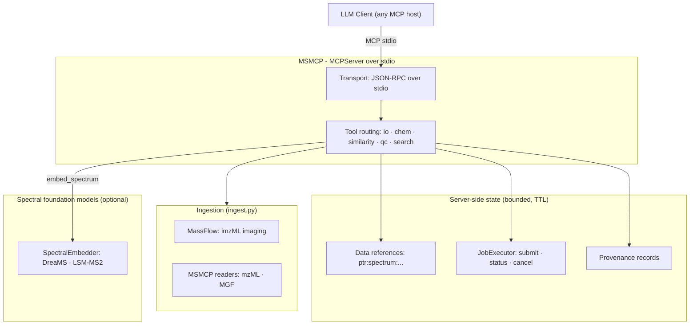

# MSMCP

**A Model Context Protocol server that turns mass spectrometry into a first-class tool for agentic AI workflows — without ever stuffing spectral data into a context window.**

MSMCP exposes exact-mass validation, adduct and isotope chemistry, spectral similarity scoring (classical *and* foundation-model embeddings), quality control, and asynchronous spectral library search to any LLM client that speaks the [Model Context Protocol](https://modelcontextprotocol.io).

Large acquisitions never enter the conversation: spectra are parsed into **server-side data references**, so an agent can hand a 100,000-peak spectrum to the next tool as a short `ptr:spectrum:…` string, with structured **provenance** attached to every derived result.

[](https://www.python.org/)
[](https://docs.astral.sh/uv/)
[](LICENSE)

---

## Table of contents

1. [The problem: the Dark Metabolome meets the context window](#the-problem-the-dark-metabolome-meets-the-context-window)
2. [The solution: an MCP adapter with a data-reference store](#the-solution-an-mcp-adapter-with-a-data-reference-store)
3. [Server-side data references](#server-side-data-references)
4. [How async dispatch solves execution timeouts](#how-async-dispatch-solves-execution-timeouts)
5. [Architecture](#architecture)
6. [Quick start](#quick-start)
7. [Connecting an LLM client](#connecting-an-llm-client)
8. [An agent working through MSMCP](#an-agent-working-through-msmcp)
9. [Tool reference](#tool-reference)
10. [Supported input formats](#supported-input-formats)
11. [Provenance](#provenance)
12. [Spectral foundation models](#spectral-foundation-models)
13. [Asynchronous job orchestration](#asynchronous-job-orchestration)
14. [Developer ergonomics](#developer-ergonomics)
15. [Repository layout](#repository-layout)
16. [Known limitations & roadmap](#known-limitations--roadmap)
17. [Security notes](#security-notes)
18. [Configuration reference](#configuration-reference)

For the full design — scope boundaries, layer rules, and the v1.0 acceptance
criteria — see **[ARCHITECTURE.md](ARCHITECTURE.md)**.

---

## The problem: the Dark Metabolome meets the context window

Untargeted metabolomics is a data-volume problem wrapped around a chemistry problem. A single LC–MS/MS run produces thousands of spectra and **easily more than 100,000 peaks**; reference libraries contain **hundreds of thousands of spectra**. Even a 1M-token context window cannot hold one unfiltered run — and pasting raw peak lists into a prompt is the worst possible use of it: token burn, truncated spectra, and a standing invitation to hallucinate molecular identifications.

Worse, the chemistry itself is largely unknown. In untargeted studies, the overwhelming majority of detected features routinely lack confident structural annotation — the **Dark Metabolome**: the vast chemical space that instruments detect but reference databases do not yet name. Identifying anything in it demands:

- **Exact-mass rigor** — rejecting plausible-sounding but physically impossible proposals (ppm validation, isotope arithmetic);
- **Similarity at scale** — scanning huge libraries with classical peak matching *and* learned embeddings that generalise to spectra never seen before;
- **Statistically honest scoring** — FDR control rather than "looks similar" vibes.

All of that is deterministic, well-understood computation. **LLMs should reason about it; they should not perform it.**

## The solution: an MCP adapter with a data-reference store

MSMCP is a thin adapter between an LLM host and a stack of analytical engines:

- **Transport layer** — an [MCPServer](https://github.com/modelcontextprotocol/python-sdk) speaking JSON-RPC over stdio, launched as a child process by the LLM host. All diagnostics are logged to stderr; stdout carries only MCP framing.
- **Ingestion layer** (`src/msmcp/ingest.py`) — one dispatcher that picks the right reader for a file, and one canonical output type. [MassFlow](https://github.com/) is the canonical layer for everything it supports (imzML imaging data); MSMCP owns small readers for the formats MassFlow does not cover (mzML, MGF).
- **Analytical engines** — pure, deterministic, unit-tested Python modules under `src/msmcp/tools/` that perform the actual science: exact-mass arithmetic, adduct shifts, isotope annotation, ppm validation, cosine scoring, QC metrics, and chunked library scanning.
- **Data-reference store** (`src/msmcp/state/`) — a bounded, thread-safe registry of scientific payloads that stay on the server. This is what lets an agent hand a 100,000-peak spectrum to the next tool as a 30-character string.
- **Provenance** (`src/msmcp/provenance.py`) — immutable, structured records attached to every derived object: which operation, which parameters, which file (with reader backend and digest), which parent references, which software and model versions.
- **Model adapters** — a pluggable `SpectralEmbedder` interface (`src/msmcp/models/`) behind which spectral foundation models (DreaMS, LSM-MS2) plug in without touching the tool layer. Optional: core MSMCP never requires model weights.
- **Execution** (`src/msmcp/execution/`) — long-running work goes through a `JobExecutor` interface. v1.0 ships a local asyncio implementation; the server does not know or care whether the backend is a thread pool, a process pool or an orchestrator.

The server holds only bounded, TTL-limited state: registered data references and job records. The division of labour is explicit: **the LLM plans, the tools compute, the store remembers.**

## Server-side data references

A **`DataReference`** is a compact, opaque handle to science that stays on the server:

```
ptr:spectrum:9f3c1a4e7b2d...
```

The flow is what keeps spectral data out of the context window:

```text
load_spectrum(file_path="run42.mzML", spectrum_index=0)
  -> {"reference": "ptr:spectrum:9f3c…", "n_peaks": 100000,
      "mz_range": [50.0, 2000.0], "tic": 1.7e9,
      "provenance": {"operation": "load_spectrum", …}}

search_library(spectrum_reference="ptr:spectrum:9f3c…",
               database_file="libraries/metabolomics.db")
  -> returns a job ID immediately; the peaks never left the server

release_reference(reference="ptr:spectrum:9f3c…")
  -> freed now instead of waiting for the retention period
```

The properties that make it safe to rely on:

- **Opaque and stable** — generated from `secrets.token_hex`. Never a Python `id()`, a memory address or a path. Stable for the reference's lifetime, never reused after release.
- **Metadata, never payload** — a reference describes its data (kind, shape, byte size, lifetime, provenance). Its serialised form cannot contain the peaks.
- **Immutable** — registration validates the payload against its kind and stores it with read-only buffers, so a caller that mutates its own array cannot change what a later tool reads.
- **Bounded** — `MSMCP_MAX_REFERENCES` (default 128) and `MSMCP_MAX_TOTAL_BYTES` (default 512 MiB) are enforced by **refusing** new registrations, never by evicting data someone still holds. A resource error must not become a wrong answer.
- **Expiring and releasable** — `MSMCP_REFERENCE_TTL_SECONDS` (default 3600; `0` disables) expires references lazily on access; `release_reference` frees them immediately and is idempotent.
- **Namespaced** — the store partitions references by namespace so one workflow cannot dereference another's data.

**What is not claimed:** MSMCP does not claim *zero-copy*. Registration takes one defensive copy to guarantee immutability, and PyArrow is not a dependency. The guarantee that is actually tested is that the payload is **never serialised through MCP/JSON** — which is the one that matters to an agent.

> **Migrating from the earlier “memory pointer” wording:** the job ID returned by `search_library` is an execution handle, not a data reference. Both remain: job IDs address *work in flight*, `DataReference`s address *data at rest*.

## How async dispatch solves execution timeouts

LLM hosts impose hard timeouts on tool calls — typically a minute or less. A library scan takes minutes. Naive synchronous tools therefore *guarantee* host-side timeouts.

MSMCP's dispatcher/poller split changes the failure model:

| Problem | The job executor's answer |
|---|---|
| Tool call exceeds the host timeout | `submit` returns in milliseconds; the scan continues on a worker thread via `asyncio.to_thread` |
| Server restarts mid-search | Job state is in-memory and is lost — the price of zero infrastructure (see [limitations](#known-limitations--roadmap)) |
| Too many concurrent searches | A bounded semaphore caps simultaneously running scans, so an eager agent cannot exhaust the CPU |
| Failure with no signal | Failed jobs carry the full exception traceback, retrievable by the poller |
| "Is it done yet?" | Status transitions (queued → running → completed/failed/cancelled) are queryable by job ID at any time |

Finished jobs are expired from the executor after a one-hour TTL, so a long-running server never accumulates unbounded state.

## Architecture



**Separation of concerns in one sentence:** the transport marshals requests, the ingestion layer picks a reader, the tool modules implement the analytical engines, the reference store owns data at rest, the executor owns work in flight, and provenance records how each result was produced — no layer reaches into another's internals.

## Quick start

Prerequisites: [uv](https://docs.astral.sh/uv/) and Python 3.13 (managed automatically via `.python-version`).

```bash
# 1. Clone and sync (creates the venv, installs runtime + dev dependencies)
git clone <repository-url> msmcp && cd msmcp
uv sync --extra dev

# 2. Lint, test, and launch the server
uv run ruff check .
uv run mypy
uv run basedpyright
uv run pytest       # fast unit suite (the eval notebook is deselected)
uv run msmcp        # starts the MCP server on stdio

# 3. Or run the whole pipeline — sync, format, lint, unit tests, eval notebook, repomix pack
make all
```

`uv` is the canonical tool — every command runs through it:

| Task | Command |
|---|---|
| Sync environment | `uv sync --extra dev` |
| Format | `uv run ruff format .` |
| Lint | `uv run ruff check .` · `uv run mypy` · `uv run basedpyright` |
| Test | `uv run pytest` |
| Evaluate end to end | `uv run pytest tests/test_eval_notebook.py -m eval -s -q` |
| Run the server | `uv run msmcp` |

The `Makefile` wraps these into one pipeline: `make lint`, `make test`, `make eval`, and `make all` (sync → format → lint → unit tests → evaluation notebook → repomix pack). Every target depends on `install`, so `make all` works from a fresh clone without a separate sync step. `make test` deliberately omits the evaluation notebook — that is `make eval` — to keep the inner loop at a few seconds.

Re-run `uv sync --extra dev` after changing `pyproject.toml`. The optional `repomix` pack (Node-based) is run as `repomix --style xml --output repomix-output.xml`.

## Connecting an LLM client

MSMCP is a child-process MCP server. Any host that supports stdio MCP servers can spawn it with `uv run msmcp` from the project root.

Example configuration for **Zed** (`.zed/settings.json`):

```json
{
  "context_servers": {
    "msmcp": {
      "command": {
        "path": "uv",
        "args": ["run", "msmcp"]
      }
    }
  }
}
```

## An agent working through MSMCP

```text
User:    "What's in run42/experiment.mzML? Then search it."

Agent:   load_spectrum(file_path="run42/experiment.mzML", spectrum_index=0)
  → {"reference": "ptr:spectrum:9f3c…", "format": "mzML",
     "n_peaks": 842, "mz_range": [50.0, 900.1], "tic": 4.1e7,
     "provenance": {"operation": "load_spectrum", …}}

Agent:   summarise_reference(reference="ptr:spectrum:9f3c…")
  → "Spectrum #0 | MS2 | RT: 2.00 min … Top 10 peaks …
     Provenance: load_spectrum … source: run42/experiment.mzML"

Agent:   search_library(spectrum_reference="ptr:spectrum:9f3c…",
                        database_file="libraries/metabolomics.db",
                        scoring_method="dreams")
  → "Job ID: 362c0267… (the peaks never entered the conversation)"

Agent:   check_search_status(job_id="362c0267…")
  → "🔄 Running — scanning the spectral library …"

Agent:   check_search_status(job_id="362c0267…")
  → "## Spectral Library Search Results …
     | Rank | Compound | Score | FDR (q-value) | Precursor m/z | Formula | …"

Agent:   validate_precursor(theoretical_mass=194.0804, experimental_mass=194.0831)
  → "VALIDATION REJECTED — Mass error: 13.9 ppm … Reconsider the molecular
     formula, adduct assignment, or instrument calibration."

Agent:   release_reference(reference="ptr:spectrum:9f3c…")
  → "Released. The stored peaks are no longer available."

Agent:   "The top hit is caffeine, but the precursor mass error (13.9 ppm)
         fails validation — likely a sodiated adduct. Let me check…"
```

The agent carries references, job IDs and verdicts — never spectra.

> **Note on this walkthrough:** the *query* spectrum is genuinely read from `experiment.mzML`. The **library** is not: MSMCP has no spectral-library reader yet, so `search_library` substitutes a synthetic library of 500–5,000 spectra seeded from the `metabolomics.db` string. Both the dispatch reply and the final report say so, in a banner that precedes the hit table. Treat the hits as a demonstration of the scoring machinery, never as identifications. See *Known limitations & roadmap*.

## Tool reference

Thirteen tools are exposed to the model: compact Markdown (or a single sentence) for human/LLM reading, and a structured object where a data reference is involved.

| Tool | Module | Purpose |
|---|---|---|
| `ping` | `server.py` | Diagnostic health check |
| `load_mzml_summary` | `tools/io.py` | First-*N*-spectra text summary of a local `.mzML` file |
| `load_spectrum` | `tools/io.py` | Parse one spectrum from any supported format and register it server-side; returns a `DataReference` plus metadata and provenance |
| `summarise_reference` | `tools/io.py` | Read a referenced spectrum back from server memory (no file re-read) |
| `release_reference` | `tools/io.py` | Free a reference immediately rather than waiting for expiry |
| `predict_adduct_offset` | `tools/chem.py` | Exact mass shift for 14 canonical adducts |
| `annotate_isotopes` | `tools/chem.py` | M / M+1 / M+2 pattern from a formula or SMILES |
| `validate_precursor` | `tools/similarity.py` | ppm mass-error gate at the 5.0 ppm threshold |
| `compute_cosine` | `tools/similarity.py` | Classical or real-embedding spectral similarity (embeddings require real inference) |
| `generate_qc_summary` | `tools/qc.py` | Truthful QC metrics (TIC, spectrum counts, peak density, estimated SNR) from a real file |
| `search_library` | `tools/search.py` | Asynchronous library search (job executor; classical or real-embedding scoring). The **query** is real data; the **library** is explicitly synthetic |
| `check_search_status` | `tools/search.py` | Poll a dispatched search by job ID. The report is delivered once; later polls return a short digest, and `full_report=True` re-requests it |
| `cancel_search` | `tools/search.py` | Cancel a pending or running search job |

Only `cancel_search` and `release_reference` mutate server state, and both advertise that on the wire.

## Supported input formats

The reader is chosen from the file extension; every reader produces the same spectrum type, so no tool needs to know the format.

| Format | Reader | Notes |
|---|---|---|
| `.mzML`, `.mzML.gz` | `msmcp.mzml` | dependency-free; zlib-compressed binary arrays supported |
| `.mgf`, `.mgf.gz` | `msmcp.mgf` | strict: an unparseable peak line raises rather than being skipped |
| `.imzML` (+ `.ibd`) | MassFlow | imaging data; pixel coordinates are preserved on each spectrum |
| `.raw`, `.d`, `.wiff`, `.mzXML` | — | recognised and refused, naming the vendor and suggesting MSConvert |

MassFlow is a required dependency, but the installed release (0.1.x) is an **imaging** framework: it reads imzML/zarr/HDF5 and exposes no mzML or MGF reader. MSMCP therefore routes exactly what MassFlow supports through MassFlow, and owns small readers for the rest. That is a documented consequence of the available library, not a preference.

Two MassFlow behaviours are worth knowing before debugging an unexpected directory or log line:

- Importing MassFlow's data manager **reconfigures the root logger to write to stdout**, which would corrupt the stdio JSON-RPC framing. `massflow_io` repoints those handlers at stderr on import, and a test asserts that no handler in the process targets stdout after a read.
- The same import **creates a `logs/` directory** in the working directory. That is library behaviour MSMCP cannot suppress; it is gitignored and documented rather than hidden.

MS-Numpress-compressed mzML arrays require the optional `pynumpress` package and raise a missing-dependency error without it.

## Provenance

Every significant object MSMCP derives carries a structured, immutable provenance record:

```json
{
  "operation": "load_spectrum",
  "created_at": "2026-09-21T17:24:18.809783+00:00",
  "parameters": {"spectrum_index": 0, "source_format": "mzML", "reader_backend": "msmcp.mzml"},
  "sources": [{"path": "run42.mzML", "format": "mzML", "backend": "msmcp.mzml",
               "size_bytes": 84213, "digest": "sha256:5b1f…"}],
  "parents": ["ptr:spectrum:9f3c…"],
  "model": null,
  "software": {"name": "msmcp", "versions": {"python": "3.13.7", "msmcp": "0.1.0", "massflow": "0.1.2", "numpy": "2.3.4"}}
}
```

A search result can therefore answer, mechanically: which query reference, which file and which reader produced it, with which scoring method and parameters, under which software versions — and, for embedding-scored work, which model and checkpoint. Digests are computed for sources up to 64 MiB; larger files report `digest: null` rather than silently omitting the field.

It is deliberately not a provenance framework: no graph, no query language, no storage. Records travel with the objects they describe.

### Example: exact-mass chemistry

```text
LLM calls: predict_adduct_offset(adduct_string="[M+H]+")
→ "Adduct: [M+H]+
   Charge state: +1
   Exact mass shift (Δ): +1.006728 Da
   m/z offset for neutral M: M + 1.006728 Da"

LLM calls: annotate_isotopes(identifier="C6H12O6")
→ "Monoisotopic mass: 180.0634 Da
   | M   | 180.0634 | 1.0000 |
   | M+1 | 181.0721 | 0.0686 |
   | M+2 | 182.0807 | 0.0147 |"

LLM calls: validate_precursor(theoretical_mass=180.0634, experimental_mass=180.0628)
→ "VALIDATION PASSED — Mass error: 3.33 ppm"
```

Hallucinated adducts (e.g. `[M+H2O]+`) are explicitly rejected with the list of supported ionisation pathways, rather than silently producing plausible-looking numbers.

SMILES → formula conversion uses RDKit when available (`uv sync --extra chem`); without it, `annotate_isotopes` falls back to a small static lookup table and asks the model to submit a formula instead of an unknown SMILES.

### Example: spectral similarity (classical → embeddings)

```text
LLM calls: compute_cosine(
    query_peaks=[[110.07, 40.0], [120.08, 100.0], [136.08, 60.0]],
    reference_peaks=[[110.07, 40.0], [120.08, 100.0], [136.08, 60.0], [500.10, 55.0]],
    scoring_method="dreams"
)
→ "Cosine Similarity (DreaMS): 0.8838
   Scoring method: DreaMS deep embedding (1024-d, L2-normalised)"
```

`scoring_method` accepts `"classical"` (greedy peak matching within a Da tolerance, with unmatched-peak reporting), `"dreams"`, or `"lsm-ms2"`. The embedding methods require real inference: if the corresponding model is unavailable in production, the tool raises `EmbeddingBackendUnavailable` rather than returning a value that looks learned. Embeddings matter for the Dark Metabolome: learned representations express *structural* similarity, so a spectrum with no library twin can still rank meaningfully against its nearest chemical neighbours — something raw peak alignment cannot do.

## Spectral foundation models

`src/msmcp/models/embeddings.py` defines a single adapter contract:

```python
class SpectralEmbedder(ABC):
    name: ClassVar[str]
    backend: ClassVar[str] = "mock"  # "mock" (test/dev-only) | "hf" (real inference)
    embedding_dim: int = 1024

    @staticmethod
    @abstractmethod
    def check_available() -> None: ...  # raises when the backend is unusable

    @abstractmethod
    def embed_spectrum(self, peaks, precursor_mz=None) -> np.ndarray: ...
```

- **Deterministic mocks (test/dev-only)** — `DreaMSEmbedder` and `LSMMS2Embedder` project peaks onto a fixed 1024-bin m/z grid, apply per-model intensity compression (√ for DreaMS, log1p for LSM-MS2), seed deterministic noise from the precursor m/z + peak content (order-independent BLAKE2b hash), and L2-normalise to `float32`. Identical spectra score exactly 1.0; shared peaks score proportionally; disjoint spectra score 0.0. **These are not learned models**: they exist only for hermetic tests/development, are reachable only under `MSMCP_EMBEDDING_BACKEND=mock`, and must never be reported as scientific results.
- **Real inference (DreaMS)** — `DreaMSInferenceEmbedder` (`src/msmcp/models/backends.py`) runs the official pre-trained 1024-d transformer (Bushuiev et al., *Nature Biotechnology* 2025). Install the package from source (`uv pip install "git+https://github.com/pluskal-lab/DreaMS.git"` — the `dreams` name on PyPI is an unrelated nanophotonics library) and the embedding checkpoint downloads automatically on first use. Spectra are embedded through the model's own preprocessing pipeline (DataFormat-A: peaks sorted by m/z, intensity max-normalised, fragments strictly below the precursor) via a temporary MGF file; the checkpoint load is cached per process and the output is L2-normalised float32.
- **Real inference (LSM-MS2)** — no public inference weights exist upstream (only peer-review code, `matterworksbio/LSM1-MS2`), so `LSMMS2InferenceEmbedder` is a bring-your-own-checkpoint adapter activated by the `MSMCP_LSM_MS2_CKPT` environment variable (the checkpoint must expose `encode(mz, intensity, precursor_mz)`); the embedding dimensionality is derived from the model output.
- **Backend selection** — `MSMCP_EMBEDDING_BACKEND=real|mock` (default `real`): `real` requires real inference and raises `EmbeddingBackendUnavailable` with install instructions when a model/checkpoint is unavailable; `mock` explicitly opts into the deterministic mocks for tests/development only. Legacy `auto`/`hf` values are treated as `real`. Tool reports disclose which backend produced each score (`real inference` vs `mock (dev/test-only, not a learned model)`).

## Asynchronous job orchestration

All long-running work goes through one interface, `JobExecutor` (`src/msmcp/execution/executor.py`):

```python
class JobExecutor(ABC):
    def submit(
        self, operation, fn, *, parameters=None, ttl_seconds=None
    ) -> JobHandle: ...
    def status(self, job_id) -> JobStatusSnapshot: ...
    def result(self, job_id) -> JobResult: ...
    def cancel(self, job_id) -> JobStatusSnapshot: ...
    def forget(self, job_id) -> bool: ...
    def list_jobs(self) -> tuple[JobStatusSnapshot, ...]: ...
    def shutdown(self) -> None: ...
```

v1.0 ships `LocalAsyncExecutor`: CPU-bound work dispatched with `asyncio.to_thread`, bounded by a semaphore (`max_concurrency`, default 4), with a one-hour TTL on finished records. No external service, daemon or database is involved.

- The dispatcher (`search_library`) resolves the real query peaks, then `submit`s the scan and returns a job ID immediately.
- The poller (`check_search_status`) reads the snapshot: `queued`/`running` → a wait message, `completed` → the full report **once** and a short digest on every later poll (`full_report=True` re-requests the report itself), `failed` → the exception traceback, `cancelled` → confirmation that partial work was discarded.
- A job the executor no longer knows about (a restart, or after its TTL) is reported as a **terminal failure**, never as an ambiguous pending state a client could spin on.

**Statuses are MCP task statuses** (`working` / `completed` / `failed` / `cancelled`), and `JobStatusSnapshot.to_task_dict()` renders a snapshot into the shape of an MCP `Task`. The installed SDK (`mcp` 2.1.1) defines the Tasks *types* but does not dispatch `tasks/get`, `tasks/result` or `tasks/cancel` — they are absent from its request unions — so MSMCP exposes the same semantics through its own polling tool and keeps the wire representation aligned. Inventing an application-level task protocol would be spec-incompatible and is deliberately not done.

**Cancellation is honest about its limits:** a worker thread cannot be interrupted, so cancelling marks the job terminal and *discards* its output. A caller that sees `cancelled` never sees a partial result.

**Portability:** the executor is the seam for a process pool, a job queue or Prefect. Nothing in v1.0 depends on one, and `JobExecutor` is what makes adding one a contained change.

## Developer ergonomics

- **Testing**: 408 pytest cases across `tests/` — chemistry (exact masses against literature values, adduct validation), similarity (5.0-ppm boundary arithmetic, greedy matching, embedding semantics), **spectral scoring** (`test_scoring.py`: the `SpectrumScorer` contract and its invariants — unmatched intensity must lower the score, empty/zero-intensity spectra score 0.0 not `nan`, scorers are pure and thread-safe), embedding backends (backend resolution, hermetic real-inference pipelines with stubbed models, checkpoint-load safety gating, stdio transport protection), the **data-reference store** (`test_pointers.py`: registration, immutability, malformed/unknown/expired/wrong-kind failures, namespace isolation, byte and count ceilings, concurrent access from real threads), **provenance** (`test_provenance.py`: immutability, JSON-safety, digests, the multi-step chain), the **job executor** (`test_executor.py`: submit/status/result/cancel, non-blocking dispatch, concurrency cap, TTL sweep, traceback-carrying failures), **ingestion** (`test_mgf.py`, `test_ingest.py`: MGF parsing and its malformed inputs, format dispatch, MassFlow-backed imzML including the stdout-logging guard and a corrupt-payload path), search (a full dispatcher → executor → poller round trip, the once-then-digest delivery contract and its re-request, real vs. synthetic halves of the pipeline, scorer routing, cancellation, failure), mzML parsing, QC, the security boundary, the **wire contract** (`test_tool_schemas.py`), an **end-to-end workflow** (`test_workflow.py`: load → reference → summarise → search → provenance → release, plus the assertion that a 100k-peak spectrum serialises to under 4 kB), and an **end-to-end stdio smoke test** (`test_smoke_stdio.py`, the only test that drives the real transport: initialize handshake, `tools/list`, a `tools/call`, and a check that every stdout line parses as JSON-RPC). Tests run hermetically: embedding backends are pinned to the test/dev-only deterministic mocks and no network or external services are required.
- **End-to-end evaluation**: `notebooks/eval_msmcp.ipynb` is the benchmark/stress suite — precursor and adduct boundaries, embedding shape/determinism/degenerate-input cases, real mzML parsing and QC, the full async search state machine (including failure, cancellation, lost-job and concurrency-cap behaviour), the server-side reference flow, and a per-tool diagnostic table. `tests/test_eval_notebook.py::test_eval_notebook_passes_every_check` executes every code cell headlessly and fails if any recorded check fails or if a registered tool is never exercised; `make eval` runs it and prints the per-tool roll-up (a machine-readable copy lands in `notebooks/.eval_artifacts/eval_report.json`). It is marked `eval` and excluded from the default `pytest` run so `make test` stays fast — `make all` runs both. A structural guard (`test_notebook_is_structurally_valid`) runs with the normal suite and fails if the notebook stops parsing, compiles, or has stored outputs.
- **Where parameter documentation lives**: the MCP SDK builds each tool's `inputSchema` from the **function signature**, not from Pydantic models. Descriptions therefore belong on `Annotated[..., Field(description=...)]` in the signature; a description added only to an input model never reaches the host. The Pydantic models in each `tools/` module are for *validation* only (they are what raises `ValidationError` on bad arguments), and they deliberately carry no `description=`. `tests/test_tool_schemas.py` fails the build if a parameter reaches the wire undocumented, or if a body constraint (e.g. `ge=1, le=50`) is missing from the schema.
- **Linting/typing**: `ruff` (E/F/I/UP/B/SIM/RUF), `mypy` and `basedpyright` all run clean over `src/`, `tests/` and the evaluation notebook, via `uv run ruff check .`, `uv run mypy` and `uv run basedpyright`. There are **no per-file suppressions for source code and no `ignore_errors` overrides**: the temporary debt from the earlier milestones has been removed rather than relocated. The only remaining ignore is `E402` on the notebook, where a cell must set environment flags before importing `msmcp`. The gitignored `drafts/` scratch directory is excluded from all three — it holds one-off scripts and audit probes, not shipped code; the audit *report* itself is kept in `docs/audit/`.
- **Formatting**: `ruff format`, line length 88, PEP 695 syntax, `from __future__ import annotations` throughout.
- **Design log**: [`docs/mcp-server-configuration.md`](docs/mcp-server-configuration.md) is an unedited transcript of the early host-configuration sessions — useful context for *why* the transport and logging boundaries are what they are, not a reference manual.
- **Audit**: [`docs/audit/2026-09-22-standard-audit.md`](docs/audit/2026-09-22-standard-audit.md) is a dated, unedited audit of the v1.0 tree. The four critical findings it reports were repaired the same day (`eeeed69`, `44ac6b7`, `b77d5fe`), and its ordered backlog is where the open work items come from. It describes the tree it was written against, not the current one.

## Repository layout

```text
msmcp/
├── .github/workflows/ci.yml     # CI: the same gate `make lint`/`test`/`eval` run locally
├── pyproject.toml               # deps, dev extras, ruff/mypy/pytest config
├── uv.lock                      # reproducible lockfile
├── Makefile                     # developer pipeline: install/format/lint/test/eval/all
├── README.md                    # this file
├── ARCHITECTURE.md              # v1.0 scope, layers, limitations, acceptance criteria
├── CHANGELOG.md                 # what landed, by release
├── docs/
│   ├── mcp-server-configuration.md  # unedited design-session transcript (host setup)
│   └── audit/
│       └── 2026-09-22-standard-audit.md  # dated audit: findings and ordered backlog
├── examples/
│   ├── msmcp_infographic.html   # one-page visual overview (illustrative)
│   └── msmcp_interactive_application.html  # interactive mock-up (illustrative)
├── src/msmcp/
│   ├── server.py                # MCPServer transport layer + entry point
│   ├── errors.py                # shared error taxonomy (malformed/missing/inaccessible)
│   ├── security.py              # local file-access boundary (root, size, spectrum limits)
│   ├── provenance.py            # structured, immutable provenance records
│   ├── ingest.py                # format dispatch: file -> the right reader
│   ├── mzml.py                  # dependency-free mzML reader (MSMCP-owned)
│   ├── mgf.py                   # dependency-free MGF reader (MSMCP-owned)
│   ├── massflow_io.py           # MassFlow-backed imzML reader + stdout-logging guard
│   ├── state/
│   │   ├── pointers.py          # DataReference + PointerStore (bounded, TTL, namespaces)
│   │   └── store.py             # the process-wide store and tool-facing helpers
│   ├── execution/
│   │   └── executor.py          # JobExecutor interface + LocalAsyncExecutor
│   ├── models/
│   │   ├── embeddings.py        # SpectralEmbedder ABC + test/dev-only deterministic mocks
│   │   ├── scoring.py           # SpectrumScorer contract + classical/embedding scorers
│   │   └── backends.py          # real-inference adapters (DreaMS/LSM-MS2) + resolver
│   └── tools/
│       ├── io.py                # ingestion, data references, compact summaries
│       ├── chem.py              # adduct shifts, isotope annotation
│       ├── similarity.py        # ppm validation, classical + embedding cosine
│       ├── qc.py                # truthful QC metrics
│       └── search.py            # executor-backed library scan
├── notebooks/
│   ├── eval_msmcp.ipynb         # end-to-end evaluation/benchmark suite (see `make eval`)
│   └── .eval_artifacts/         # generated mzML fixtures + eval_report.json (gitignored)
└── tests/
    ├── conftest.py              # hermetic fixtures (mzML, MGF, imzML) + tool harness
    ├── test_chem.py
    ├── test_similarity.py
    ├── test_embeddings.py
    ├── test_scoring.py          # SpectrumScorer contract + its scientific invariants
    ├── test_search.py
    ├── test_security.py
    ├── test_mzml.py
    ├── test_mgf.py
    ├── test_ingest.py           # format dispatch + MassFlow imzML integration
    ├── test_qc.py
    ├── test_pointers.py         # the data-reference store
    ├── test_provenance.py
    ├── test_executor.py         # the JobExecutor contract
    ├── test_workflow.py         # end-to-end: load -> reference -> search -> provenance
    ├── test_tool_schemas.py     # wire contract: titles, annotations, param docs, constraint drift
    ├── test_eval_notebook.py    # runs the eval notebook headlessly (`make eval`)
    └── test_smoke_stdio.py      # end-to-end JSON-RPC session over a real stdio pipe
```

## Known limitations & roadmap

**Forward focus: local MS database connectivity.** The next milestone is reading spectral libraries the user already has — MGF and MSP files, then a local SQLite peak store — behind a `LibraryProvider` interface, so `search_library` searches real data. MSMCP remains local, offline and self-contained: it ships no library data, downloads none, and never talks to a hosted service. See [ARCHITECTURE.md](ARCHITECTURE.md) → *Direction*.

- **Search is half real, and says which half**: the **query** spectrum is genuine data, read from disk through the ingestion layer or dereferenced from the store, so a missing or malformed query fails loudly before dispatch. The **library** is still synthetic — MSMCP has no spectral-library reader yet, and the report carries a banner saying so ahead of any hit table. Closing this is the first v1.1 item and the focus above.
- **In-process job state**: jobs live in server memory and do not survive a restart; the poller reports a lost job as failed rather than pending. A durable executor is a drop-in `JobExecutor` implementation.
- **MCP Tasks are not dispatchable by the installed SDK**: `mcp` 2.1.1 ships the Tasks types but omits `tasks/get`, `tasks/result` and `tasks/cancel` from its request unions, so no server can answer them. MSMCP keeps its snapshots in the MCP `Task` shape and exposes the semantics through `check_search_status` instead of inventing a protocol.
- **Readers MSMCP owns**: `.mzML`/`.mzML.gz` and `.mgf`/`.mgf.gz` are parsed by MSMCP itself, because MassFlow 0.1.x is imaging-only. `.imzML` goes through MassFlow. Vendor formats are refused with conversion guidance.
- **Model adapters — DreaMS real, LSM-MS2 blocked upstream**: `DreaMSInferenceEmbedder` runs real transformer inference behind the `SpectralEmbedder` interface (install the `dreams` package from source; weights auto-download). LSM-MS2 awaits a public weights release; its adapter activates via `MSMCP_LSM_MS2_CKPT`. Backend resolution is governed by `MSMCP_EMBEDDING_BACKEND` (`real` / `mock`). Neither is required for core MSMCP to run or to be tested.
- **Whole-slide images**: MassFlow materialises one placeholder per pixel when loading an imzML acquisition, so very large images are bounded by MassFlow's own behaviour.
- **MS-Numpress-compressed mzML arrays** need the optional `pynumpress` package and report a missing-dependency error without it.
- **Hardware control is out of scope for this repository, not just for v1.0.** Direct instrument control, actuation and the safety interlock layer that must precede them belong to a **different project**. MSMCP is a data and computation interface; the MCP application layer must never be the only barrier between a model and physical hardware. There is no instrument-control code here and none will be added.

See **[ARCHITECTURE.md](ARCHITECTURE.md)** for the full limitations list and the v1.0 acceptance criteria.

## Security notes

MSMCP is a **local, single-user server**: the MCP host spawns it as a child process with your credentials, so anything the server can do, a misused agent can do too. Keep these boundaries in mind:

- **Trust boundary** — anyone who can drive the LLM client can drive the server. Run it only on machines you own; it speaks stdio by design and must never be exposed as a network service.
- **File access** — every file-reading tool (`load_mzml_summary`, `load_spectrum`, `generate_qc_summary`, and `search_library`'s query) is confined to a single allowed root directory (`src/msmcp/security.py`). The default root is the server's working directory, override it with `MSMCP_ALLOWED_ROOT`. Paths that resolve outside that root — including symlinks that point outside it — are rejected with `PathEscapeError`, and for imzML the paired `.ibd` payload is checked against the same root. Files are also capped by a size limit (`MSMCP_MAX_FILE_SIZE_BYTES`, default 500 MiB) and a per-request spectrum-count limit (`MSMCP_MAX_SPECTRA`). Access failures are reported truthfully and distinctly (`InaccessiblePathError` for missing/unreadable paths, `MalformedFileError` for unparseable data, `UnsupportedFormatError` for vendor formats, `MissingDependencyError` when an optional decoder is absent) rather than as a generic failure.
- **Server-side data** — registered references are bounded (`MSMCP_MAX_REFERENCES`, `MSMCP_MAX_TOTAL_BYTES`), expire after `MSMCP_REFERENCE_TTL_SECONDS` (default 3600), are held read-only, and are namespaced. Exceeding a limit refuses the request; it never silently discards data a caller still holds. Reference identifiers are opaque random tokens, never object ids, addresses or paths.
- **Execution** — concurrent jobs are capped by the executor (default 4). A cancelled job's partial output is discarded rather than returned.
- **Checkpoint loading** — the LSM-MS2 adapter deserialises a checkpoint file (`torch.jit.load`, falling back to `torch.load` with `weights_only=True`); checkpoint files can execute arbitrary code, so only point `MSMCP_LSM_MS2_CKPT` at files you trust. A checkpoint that needs full-pickle loading is **rejected unless `MSMCP_LSM_MS2_ALLOW_UNSAFE=1` explicitly opts in** — that fallback (`torch.load` without `weights_only`) can execute arbitrary code from the file. The DreaMS adapter downloads pre-trained weights from the upstream repository on first use — pin the `dreams` install to a commit you trust.
- **Dependency side effects** — importing MassFlow's data manager reconfigures the Python root logger to write to stdout and creates a `logs/` directory in the working directory. MSMCP neutralises the first (it would corrupt the stdio framing) and documents the second. See [Supported input formats](#supported-input-formats).
- **No secrets** — the server stores no credentials, requires no API keys, and makes no network calls of its own. This is a design constraint, not a current limitation: MSMCP is intended for onsite, offline use, so remote database adapters are explicitly out of scope (see [ARCHITECTURE.md](ARCHITECTURE.md) → *Out of scope*).

## Configuration reference

| Variable | Default | Effect |
|---|---|---|
| `MSMCP_ALLOWED_ROOT` | process working directory | Filesystem root every file-reading tool is confined to |
| `MSMCP_MAX_FILE_SIZE_BYTES` | 500 MiB | Per-file size ceiling |
| `MSMCP_MAX_SPECTRA` | 1000 | Spectra a single request may ask to process |
| `MSMCP_MAX_REFERENCES` | 128 | Live server-side data references |
| `MSMCP_MAX_TOTAL_BYTES` | 512 MiB | Summed payload size held by the reference store |
| `MSMCP_REFERENCE_TTL_SECONDS` | 3600 | Reference lifetime (`0` disables expiry) |
| `MSMCP_EMBEDDING_BACKEND` | `real` | `real` requires real inference; `mock` selects the test/dev-only stand-ins |
| `MSMCP_LSM_MS2_CKPT` | unset | Path to a bring-your-own LSM-MS2 checkpoint |
| `MSMCP_LSM_MS2_ALLOW_UNSAFE` | unset | `1` opts into full-pickle checkpoint loading (unsafe) |

---

*MIT License — Copyright (c) 2026 Eric Janusson.*
