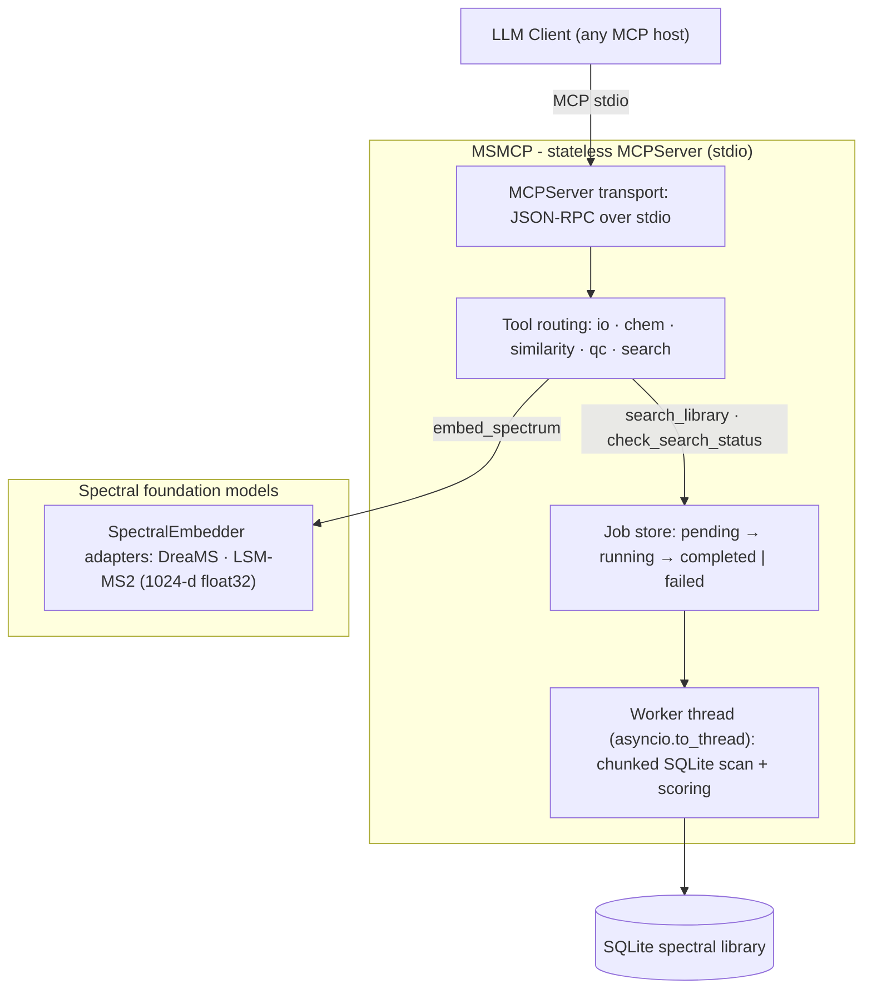

# MSMCP

**A Model Context Protocol server that turns mass spectrometry into a first-class tool for agentic AI workflows — without ever stuffing spectral data into a context window.**

MSMCP exposes exact-mass validation, adduct and isotope chemistry, spectral similarity scoring (classical *and* foundation-model embeddings), quality control, and asynchronous spectral library search to any LLM client that speaks the [Model Context Protocol](https://modelcontextprotocol.io).

[](https://www.python.org/)
[](https://docs.astral.sh/uv/)
[](LICENSE)

---

## Table of contents

1. [The problem: the Dark Metabolome meets the context window](#the-problem-the-dark-metabolome-meets-the-context-window)
2. [The solution: a stateless MCP adapter](#the-solution-a-stateless-mcp-adapter)
3. [The Memory Pointer Pattern](#the-memory-pointer-pattern)
4. [How async dispatch solves execution timeouts](#how-async-dispatch-solves-execution-timeouts)
5. [Architecture](#architecture)
6. [Quick start](#quick-start)
7. [Connecting an LLM client](#connecting-an-llm-client)
8. [An agent working through MSMCP](#an-agent-working-through-msmcp)
9. [Tool reference](#tool-reference)
10. [Spectral foundation models](#spectral-foundation-models)
11. [Asynchronous job orchestration](#asynchronous-job-orchestration)
12. [Developer ergonomics](#developer-ergonomics)
13. [Repository layout](#repository-layout)
14. [Known limitations & roadmap](#known-limitations--roadmap)

---

## The problem: the Dark Metabolome meets the context window

Untargeted metabolomics is a data-volume problem wrapped around a chemistry problem. A single LC–MS/MS run produces thousands of spectra and **easily more than 100,000 peaks**; reference libraries contain **hundreds of thousands of spectra**. Even a 1M-token context window cannot hold one unfiltered run — and pasting raw peak lists into a prompt is the worst possible use of it: token burn, truncated spectra, and a standing invitation to hallucinate molecular identifications.

Worse, the chemistry itself is largely unknown. In untargeted studies, the overwhelming majority of detected features routinely lack confident structural annotation — the **Dark Metabolome**: the vast chemical space that instruments detect but reference databases do not yet name. Identifying anything in it demands:

- **Exact-mass rigor** — rejecting plausible-sounding but physically impossible proposals (ppm validation, isotope arithmetic);
- **Similarity at scale** — scanning huge libraries with classical peak matching *and* learned embeddings that generalise to spectra never seen before;
- **Statistically honest scoring** — FDR control rather than "looks similar" vibes.

All of that is deterministic, well-understood computation. **LLMs should reason about it; they should not perform it.**

## The solution: a stateless MCP adapter

MSMCP is a thin, **stateless adapter** between an LLM host and a stack of analytical engines:

- **Transport layer** — an [MCPServer](https://github.com/modelcontextprotocol/python-sdk) speaking JSON-RPC over stdio, launched as a child process by the LLM host. All diagnostics are logged to stderr; stdout carries only MCP framing.
- **Analytical engines** — pure, deterministic, unit-tested Python modules under `src/msmcp/tools/` that perform the actual science: exact-mass arithmetic, adduct shifts, isotope annotation, ppm validation, cosine scoring, QC metrics, and chunked library scanning.
- **Model adapters** — a pluggable `SpectralEmbedder` interface (`src/msmcp/models/`) behind which spectral foundation models (DreaMS, LSM-MS2) plug in without touching the tool layer.
- **Orchestrator** — long-running library searches are dispatched as **in-process async jobs**: `asyncio.create_task` spawns a background task per search, the CPU-bound scan is offloaded to a worker thread with `asyncio.to_thread`, and a module-level job store tracks `pending → running → completed | failed` for polling. No external services, daemons, or databases required.

The server keeps job state only in a small, TTL-bounded in-process store — everything else is stateless. The division of labour is explicit: **the LLM plans, the tools compute, the job store remembers.**

## The Memory Pointer Pattern

MSMCP's asynchronous tools follow a **Memory Pointer Pattern**: the LLM never holds results in its context — it holds a *pointer*.

1. `search_library(...)` returns immediately with a tiny `job_id` (a uuid4-hex key into the in-process job store). That ID is the pointer.
2. The LLM stores the pointer — a few tokens — and continues reasoning.
3. `check_search_status(job_id=...)` dereferences the pointer on demand, returning a wait message, the completed report, or a failure traceback.

Because the pointer is all the LLM carries, context usage is **constant regardless of dataset size**, polls are idempotent and cheap, and any agent holding the pointer can resume the conversation where the last one left off. Results are compact Markdown by design — top-20 hit tables, one-line validation verdicts — engineered for token efficiency rather than human eyeballs.

## How async dispatch solves execution timeouts

LLM hosts impose hard timeouts on tool calls — typically a minute or less. A library scan takes minutes. Naive synchronous tools therefore *guarantee* host-side timeouts.

MSMCP's dispatcher/poller split changes the failure model:

| Problem | The in-process job store's answer |
|---|---|
| Tool call exceeds the host timeout | Dispatch returns in milliseconds; the scan continues on a worker thread via `asyncio.to_thread` |
| Server restarts mid-search | Job state is in-memory and is lost — the price of zero infrastructure (see [roadmap](#known-limitations--roadmap)) |
| Too many concurrent searches | A bounded semaphore caps simultaneously running scans, so an eager agent cannot exhaust the CPU |
| Failure with no signal | Failed jobs carry the full exception traceback, retrievable by the poller |
| "Is it done yet?" | Status transitions (pending → running → completed/failed) are queryable by job ID at any time |

Finished jobs are expired from the store after a one-hour TTL, so a long-running server never accumulates unbounded state.

## Architecture



**Separation of concerns in one sentence:** the MCP transport layer marshals requests, the tool modules implement the analytical engines, the model adapters own representation learning, and the job store owns in-flight execution state — no layer reaches into another's internals.

## Quick start

Prerequisites: [uv](https://docs.astral.sh/uv/) and Python 3.13 (managed automatically via `.python-version`).

```bash
# 1. Clone and install (creates the venv, syncs runtime + dev dependencies)
git clone <repository-url> msmcp && cd msmcp
make install

# 2. Lint, test, and launch the server
make lint
make test
make run          # starts the MCP server on stdio
```

Makefile targets:

| Target | Command | Purpose |
|---|---|---|
| `install` | `uv sync --extra dev` | venv + all dependencies |
| `format` | `ruff format` / `ruff check --fix` | formatting and safe fixes |
| `lint` | `ruff check` + `mypy` | static analysis |
| `test` | `pytest` | the 157-test suite |
| `run` | `uv run msmcp` | launch the server on stdio |

`format`, `lint`, and `test` first sync the dev environment (`uv sync --extra dev`), so `make all` works from a fresh clone without a separate install step. The `repomix` target additionally requires the Node-based `repomix` CLI on `PATH`.

## Connecting an LLM client

MSMCP is a child-process MCP server. Any host that supports stdio MCP servers can spawn it with `uv run msmcp` from the project root.

Example configuration for **Zed** (`.zed/settings.json`):

```json
{
  "context_servers": {
    "msmcp": {
      "command": {
        "path": "uv",
        "args": ["run", "msmcp"]
      }
    }
  }
}
```

## An agent working through MSMCP

```text
User:    "Search this run against the metabolomics library and tell me what's in it."

Agent:   search_library(experimental_file="run42/experiment.mzML",
                        database_file="libraries/metabolomics.db",
                        scoring_method="dreams")
  → "Job ID: 362c0267-…-df4a31f61197
     The spectral library search is running in the background as an
     in-process async job; use check_search_status to poll for results."

Agent:   check_search_status(job_id="362c0267-…-df4a31f61197")
  → "🔄 Running — search job … is scanning the spectral library and
     computing statistics. Poll again shortly."

Agent:   check_search_status(job_id="362c0267-…-df4a31f61197")
  → "## Spectral Library Search Results
     Scoring method: DreaMS deep embedding (1024-d)
     | Rank | Compound | Score | FDR (q-value) | Precursor m/z | Formula | …"

Agent:   validate_precursor(theoretical_mass=194.0804, experimental_mass=194.0831)
  → "VALIDATION REJECTED — Mass error: 13.9 ppm … Reconsider the molecular
     formula, adduct assignment, or instrument calibration."

Agent:   "The top hit is caffeine, but the precursor mass error (13.9 ppm)
         fails validation — likely a sodiated adduct. Let me check…"
```

The agent carries job IDs and verdicts — never spectra.

## Tool reference

Nine tools are exposed to the model. Everything returns compact Markdown (or a single sentence).

| Tool | Module | Purpose |
|---|---|---|
| `ping` | `server.py` | Diagnostic health check |
| `load_mzml_summary` | `tools/io.py` | First-*N*-spectra summary of a local `.mzML` / `.mgf` file |
| `predict_adduct_offset` | `tools/chem.py` | Exact mass shift for 14 canonical adducts |
| `annotate_isotopes` | `tools/chem.py` | M / M+1 / M+2 pattern from a formula or SMILES |
| `validate_precursor` | `tools/similarity.py` | ppm mass-error gate at the 5.0 ppm threshold |
| `compute_cosine` | `tools/similarity.py` | Classical or embedding-based spectral similarity |
| `generate_qc_summary` | `tools/qc.py` | Spectral QC metrics + pipeline routing recommendation (synthetic demo dataset until real parsing lands) |
| `search_library` | `tools/search.py` | Asynchronous library search over a synthetic in-process SQLite library (job store; classical or embedding scoring) |
| `check_search_status` | `tools/search.py` | Poll a dispatched search by job ID |

### Example: exact-mass chemistry

```text
LLM calls: predict_adduct_offset(adduct_string="[M+H]+")
→ "Adduct: [M+H]+
   Charge state: +1
   Exact mass shift (Δ): +1.006728 Da
   m/z offset for neutral M: M + 1.006728 Da"

LLM calls: annotate_isotopes(identifier="C6H12O6")
→ "Monoisotopic mass: 180.0634 Da
   | M   | 180.0634 | 1.0000 |
   | M+1 | 181.0721 | 0.0686 |
   | M+2 | 182.0807 | 0.0147 |"

LLM calls: validate_precursor(theoretical_mass=180.0634, experimental_mass=180.0628)
→ "VALIDATION PASSED — Mass error: 3.33 ppm"
```

Hallucinated adducts (e.g. `[M+H2O]+`) are explicitly rejected with the list of supported ionisation pathways, rather than silently producing plausible-looking numbers.

SMILES → formula conversion uses RDKit when available (`uv sync --extra chem`); without it, `annotate_isotopes` falls back to a small static lookup table and asks the model to submit a formula instead of an unknown SMILES.

### Example: spectral similarity (classical → embeddings)

```text
LLM calls: compute_cosine(
    query_peaks=[[110.07, 40.0], [120.08, 100.0], [136.08, 60.0]],
    reference_peaks=[[110.07, 40.0], [120.08, 100.0], [136.08, 60.0], [500.10, 55.0]],
    scoring_method="dreams"
)
→ "Cosine Similarity (DreaMS): 0.8838
   Scoring method: DreaMS deep embedding (1024-d, L2-normalised)"
```

`scoring_method` accepts `"classical"` (greedy peak matching within a Da tolerance, with unmatched-peak reporting), `"dreams"`, or `"lsm-ms2"`. Embeddings matter for the Dark Metabolome: learned representations express *structural* similarity, so a spectrum with no library twin can still rank meaningfully against its nearest chemical neighbours — something raw peak alignment cannot do.

## Spectral foundation models

`src/msmcp/models/embeddings.py` defines a single adapter contract:

```python
class SpectralEmbedder(ABC):
    name: ClassVar[str]
    backend: ClassVar[str] = "mock"  # "mock" (fallback) | "hf" (real inference)
    embedding_dim: int = 1024

    @staticmethod
    @abstractmethod
    def check_available() -> None: ...  # raises when the backend is unusable

    @abstractmethod
    def embed_spectrum(self, peaks, precursor_mz=None) -> np.ndarray: ...
```

- **Deterministic fallbacks** — `DreaMSEmbedder` and `LSMMS2Embedder` project peaks onto a fixed 1024-bin m/z grid, apply per-model intensity compression (√ for DreaMS, log1p for LSM-MS2), seed deterministic noise from the precursor m/z + peak content (order-independent BLAKE2b hash), and L2-normalise to `float32`. Identical spectra score exactly 1.0; shared peaks score proportionally; disjoint spectra score 0.0. The fallbacks keep the server fully operational with zero ML dependencies and are the default in the test suite.
- **Real inference (DreaMS)** — `DreaMSInferenceEmbedder` (`src/msmcp/models/backends.py`) runs the official pre-trained 1024-d transformer (Bushuiev et al., *Nature Biotechnology* 2025). Install the package from source (`uv pip install "git+https://github.com/pluskal-lab/DreaMS.git"` — the `dreams` name on PyPI is an unrelated nanophotonics library) and the embedding checkpoint downloads automatically on first use. Spectra are embedded through the model's own preprocessing pipeline (DataFormat-A: peaks sorted by m/z, intensity max-normalised, fragments strictly below the precursor) via a temporary MGF file; the checkpoint load is cached per process and the output is L2-normalised float32.
- **Real inference (LSM-MS2)** — no public inference weights exist upstream (only peer-review code, `matterworksbio/LSM1-MS2`), so `LSMMS2InferenceEmbedder` is a bring-your-own-checkpoint adapter activated by the `MSMCP_LSM_MS2_CKPT` environment variable (the checkpoint must expose `encode(mz, intensity, precursor_mz)`); the embedding dimensionality is derived from the model output.
- **Backend selection** — `MSMCP_EMBEDDING_BACKEND=mock|auto|hf` (default `auto`): `auto` uses real inference when the package is installed and logs a fallback warning otherwise; `mock` pins the deterministic stand-ins; `hf` fails loudly with install instructions when the backend is unavailable. Tool reports disclose which backend produced each score (`real inference` vs `deterministic fallback`).

## Asynchronous job orchestration

Library searches are **in-process async jobs**, not fire-and-forget coroutines:

```python
@dataclass
class SearchJob:
    job_id: str
    experimental_file: str
    database_file: str
    scoring_method: str
    status: str = "pending"  # pending → running → completed | failed
    result: str | None = None  # final Markdown report once completed
    error: str | None = None  # formatted traceback once failed
```

- The dispatcher (`search_library`) records the job in the module-level `_JOB_STORE` and spawns `_run_search_task` via `asyncio.create_task`; the CPU-bound scan runs on a worker thread via `asyncio.to_thread`, so the MCP event loop is never blocked.
- The poller (`check_search_status`) reads the job by ID: `pending/running → wait message`, `completed → the Markdown report`, `failed → the exception traceback`.
- A bounded semaphore caps concurrent searches, and finished jobs are expired from the store after a one-hour TTL (`_schedule_cleanup`), so a long-running server never accumulates unbounded state.
- **Trade-off vs. an external orchestrator**: job state lives in server memory and is lost if the server restarts mid-search — the price of zero infrastructure. An earlier revision of this server used Prefect for durable flow runs; that dependency was removed in the async rewrite and is the roadmap path back to restart-safe, multi-process execution.

## Developer ergonomics

- **Testing**: 157 pytest cases across `tests/` — chemistry (exact masses against literature values, adduct validation), similarity (5.0-ppm boundary arithmetic, greedy matching, embedding semantics), embedding backends (backend resolution, hermetic real-inference pipelines with stubbed models, checkpoint-load safety gating, stdio transport protection), and search (a full dispatcher → job store → poller round trip, scorer routing, TTL cleanup, and the failure path). Tests run hermetically: embedding backends are pinned to the deterministic mocks and no network or external services are required.
- **Linting/typing**: `ruff` (E/F/I/UP/B/SIM/RUF) and `mypy` on `src/` + `tests/` via `make lint`. Pre-existing findings in the older tool modules are tracked as explicit `per-file-ignores` debt in `pyproject.toml`, to be removed file-by-file; newer modules (server, models, search, tests) are clean.
- **Formatting**: `ruff format`, line length 88, PEP 695 syntax, `from __future__ import annotations` throughout.

## Repository layout

```text
msmcp/
├── Makefile                     # install · format · lint · test · run
├── pyproject.toml               # deps, dev extras, ruff/mypy/pytest config
├── uv.lock                      # reproducible lockfile
├── src/msmcp/
│   ├── server.py                # MCPServer transport layer + entry point
│   ├── models/
│   │   ├── embeddings.py        # SpectralEmbedder ABC + deterministic fallbacks
│   │   └── backends.py          # real-inference adapters (DreaMS/LSM-MS2) + resolver
│   └── tools/
│       ├── io.py                # mzML/mgf ingestion summaries
│       ├── chem.py              # adduct shifts, isotope annotation
│       ├── similarity.py        # ppm validation, classical + embedding cosine
│       ├── qc.py                # QC metrics + pipeline routing
│       └── search.py            # in-process async job store + library scan
└── tests/
    ├── conftest.py              # hermetic fixtures + registered-tool harness
    ├── test_chem.py
    ├── test_similarity.py
    ├── test_embeddings.py
    ├── test_search.py
    └── smoke_stdio.py           # end-to-end JSON-RPC session over a real stdio pipe
```

## Known limitations & roadmap

- **MCP SDK migration (complete)**: the current `mcp>=2` SDK line removed the legacy `FastMCP` API; `src/msmcp/server.py` targets the `MCPServer` API (`mcp.server.mcpserver`). The analytical engines and tests are transport-agnostic.
- **Model adapters — DreaMS real, LSM-MS2 blocked upstream**: `DreaMSInferenceEmbedder` runs real transformer inference behind the `SpectralEmbedder` interface (install the `dreams` package from source; weights auto-download). LSM-MS2 awaits a public weights release; its adapter activates via `MSMCP_LSM_MS2_CKPT`. Backend resolution is governed by `MSMCP_EMBEDDING_BACKEND` (`mock` / `auto` / `hf`).
- **In-process job state**: search jobs live in server memory and do not survive a restart; a durable orchestrator (e.g. Prefect or a job queue) is the roadmap item for restart-safe, multi-process execution.
- **Synthetic analysis data (current)**: `search_library` and `generate_qc_summary` run their full pipelines on deterministic synthetic data seeded from their path arguments — an in-memory SQLite library of 500–5 000 spectra for the search, a synthetic metric dataset for QC. The `experimental_file` / `database_file` / `file_path` arguments are validated but not yet read; everything downstream (chunked scanning, scoring, FDR / empirical p-values, report formatting) is real. Treat current reports as pipeline demonstrations, not identifications of real data.
- **Real vendor/library I/O (roadmap)**: wire `massflow` parsing of real `.mzML`/`.mgf` files into the tools (replacing the development mocks) and open user-supplied SQLite spectral libraries in `search_library`.

## Security notes

MSMCP is a **local, single-user server**: the MCP host spawns it as a child process with your credentials, so anything the server can do, a misused agent can do too. Keep these boundaries in mind:

- **Trust boundary** — anyone who can drive the LLM client can drive the server. Run it only on machines you own; it speaks stdio by design and must never be exposed as a network service.
- **File access** — `load_mzml_summary` reads whatever path the model names (when `massflow` is installed). Don't attach this server to an agent that may be prompted to read sensitive files.
- **Checkpoint loading** — the LSM-MS2 adapter deserialises a checkpoint file (`torch.jit.load`, falling back to `torch.load` with `weights_only=True`); checkpoint files can execute arbitrary code, so only point `MSMCP_LSM_MS2_CKPT` at files you trust. A checkpoint that needs full-pickle loading is **rejected unless `MSMCP_LSM_MS2_ALLOW_UNSAFE=1` explicitly opts in** — that fallback (`torch.load` without `weights_only`) can execute arbitrary code from the file. The DreaMS adapter downloads pre-trained weights from the upstream repository on first use — pin the `dreams` install to a commit you trust.
- **No secrets** — the server stores no credentials, requires no API keys, and makes no network calls of its own.

---

*MIT License — Copyright (c) 2026 Eric Janusson.*
