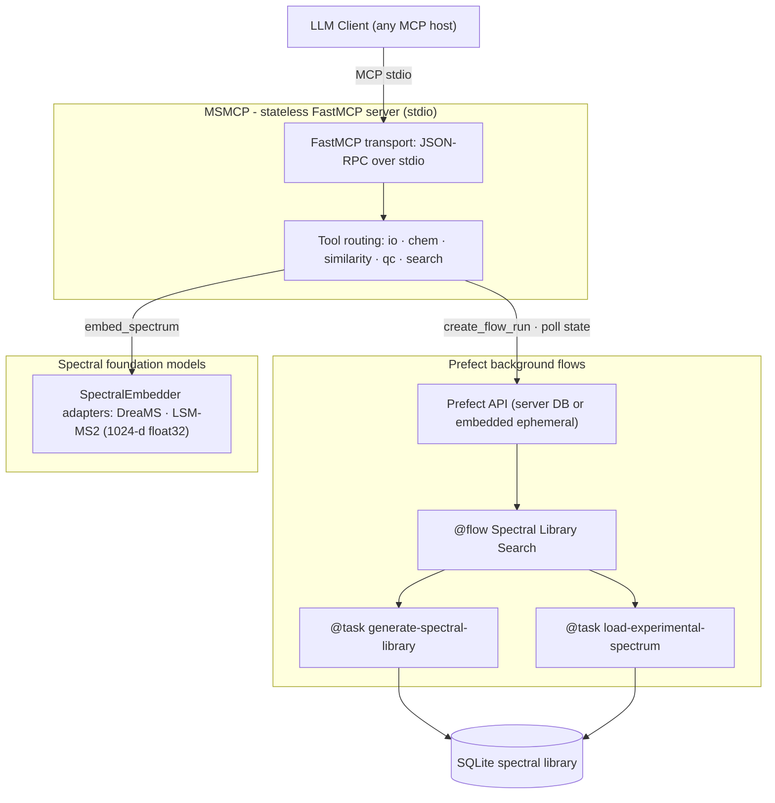

# MSMCP

**A Model Context Protocol server that turns mass spectrometry into a first-class tool for agentic AI workflows — without ever stuffing spectral data into a context window.**

MSMCP exposes exact-mass validation, adduct and isotope chemistry, spectral similarity scoring (classical *and* foundation-model embeddings), quality control, and asynchronous spectral library search to any LLM client that speaks the [Model Context Protocol](https://modelcontextprotocol.io).

[](https://www.python.org/)
[](https://docs.astral.sh/uv/)
[](https://www.prefect.io/)
[](LICENSE)

---

## Table of contents

1. [The problem: the Dark Metabolome meets the context window](#the-problem-the-dark-metabolome-meets-the-context-window)
2. [The solution: a stateless MCP adapter](#the-solution-a-stateless-mcp-adapter)
3. [The Memory Pointer Pattern](#the-memory-pointer-pattern)
4. [How Prefect solves execution timeouts](#how-prefect-solves-execution-timeouts)
5. [Architecture](#architecture)
6. [Quick start](#quick-start)
7. [Connecting an LLM client](#connecting-an-llm-client)
8. [An agent working through MSMCP](#an-agent-working-through-msmcp)
9. [Tool reference](#tool-reference)
10. [Spectral foundation models](#spectral-foundation-models)
11. [Durable orchestration with Prefect](#durable-orchestration-with-prefect)
12. [Developer ergonomics](#developer-ergonomics)
13. [Repository layout](#repository-layout)
14. [Known limitations & roadmap](#known-limitations--roadmap)

---

## The problem: the Dark Metabolome meets the context window

Untargeted metabolomics is a data-volume problem wrapped around a chemistry problem. A single LC–MS/MS run produces thousands of spectra and **easily more than 100,000 peaks**; reference libraries contain **hundreds of thousands of spectra**. Even a 1M-token context window cannot hold one unfiltered run — and pasting raw peak lists into a prompt is the worst possible use of it: token burn, truncated spectra, and a standing invitation to hallucinate molecular identifications.

Worse, the chemistry itself is largely unknown. In untargeted studies, the overwhelming majority of detected features routinely lack confident structural annotation — the **Dark Metabolome**: the vast chemical space that instruments detect but reference databases do not yet name. Identifying anything in it demands:

- **Exact-mass rigor** — rejecting plausible-sounding but physically impossible proposals (ppm validation, isotope arithmetic);
- **Similarity at scale** — scanning huge libraries with classical peak matching *and* learned embeddings that generalise to spectra never seen before;
- **Statistically honest scoring** — FDR control rather than "looks similar" vibes.

All of that is deterministic, well-understood computation. **LLMs should reason about it; they should not perform it.**

## The solution: a stateless MCP adapter

MSMCP is a thin, **stateless adapter** between an LLM host and a stack of analytical engines:

- **Transport layer** — a [FastMCP](https://github.com/modelcontextprotocol/python-sdk) server speaking JSON-RPC over stdio, launched as a child process by the LLM host. All diagnostics are logged to stderr; stdout carries only MCP framing.
- **Analytical engines** — pure, deterministic, unit-tested Python modules under `src/msmcp/tools/` that perform the actual science: exact-mass arithmetic, adduct shifts, isotope annotation, ppm validation, cosine scoring, QC metrics, and chunked library scanning.
- **Model adapters** — a pluggable `SpectralEmbedder` interface (`src/msmcp/models/`) behind which spectral foundation models (DreaMS, LSM-MS2) plug in without touching the tool layer.
- **Orchestrator** — long-running library searches are dispatched as **Prefect flow runs**, not in-memory jobs: state lives in the Prefect API (or an embedded ephemeral server during development), survives restarts, and is observable in the Prefect UI.

The server itself keeps **no job state** — that is the architecture's central idea. The division of labour is explicit: **the LLM plans, the tools compute, Prefect remembers.**

## The Memory Pointer Pattern

MSMCP's asynchronous tools follow a **Memory Pointer Pattern**: the LLM never holds results in its context — it holds a *pointer*.

1. `search_library(...)` returns immediately with a tiny `job_id` (the Prefect flow-run ID). That ID is the pointer.
2. The LLM stores the pointer — a few tokens — and continues reasoning.
3. `check_search_status(job_id=...)` dereferences the pointer on demand, returning a wait message, the completed report, or a failure traceback.

Because the pointer is all the LLM carries, context usage is **constant regardless of dataset size**, polls are idempotent and cheap, and any agent (or human operator, or the Prefect UI) holding the pointer can resume the conversation where the last one left off. Results are compact Markdown by design — top-20 hit tables, one-line validation verdicts — engineered for token efficiency rather than human eyeballs.

## How Prefect solves execution timeouts

LLM hosts impose hard timeouts on tool calls — typically a minute or less. A library scan takes minutes. Naive synchronous tools therefore *guarantee* host-side timeouts, and naive in-process job stores lose state the moment the server restarts.

Prefect changes the failure model:

| Problem | Prefect's answer |
|---|---|
| Tool call exceeds the host timeout | Dispatch returns in milliseconds; execution continues server-side as a flow run |
| Server restarts mid-search | Flow-run state and persisted results live in the Prefect API, not in server memory |
| One busy worker | Flow runs are first-class citizens: they can move to remote workers via work pools |
| Failure with no signal | Failed runs carry the full exception traceback, retrievable by the poller |
| "Is it done yet?" | State transitions (Pending → Running → Completed/Failed) are queryable by ID at any time |

During local development Prefect runs an embedded ephemeral server, so the exact same dispatcher/poller contract is exercised with zero infrastructure.

## Architecture



**Separation of concerns in one sentence:** the MCP transport layer marshals requests, the tool modules implement the analytical engines, the model adapters own representation learning, and Prefect owns execution state and lineage — no layer reaches into another's internals.

## Quick start

Prerequisites: [uv](https://docs.astral.sh/uv/) and Python 3.13 (managed automatically via `.python-version`).

```bash
# 1. Clone and install (creates the venv, syncs runtime + dev dependencies)
git clone <repository-url> msmcp && cd msmcp
make install

# 2. Lint, test, and launch the server
make lint
make test
make run          # starts the MCP server on stdio
```

Makefile targets:

| Target | Command | Purpose |
|---|---|---|
| `install` | `uv sync --extra dev` | venv + all dependencies |
| `format` | `ruff format` / `ruff check --fix` | formatting and safe fixes |
| `lint` | `ruff check` + `mypy` | static analysis |
| `test` | `pytest` | the 132-test suite |
| `run` | `uv run msmcp` | launch the server on stdio |

## Connecting an LLM client

MSMCP is a child-process MCP server. Any host that supports stdio MCP servers can spawn it with `uv run msmcp` from the project root.

Example configuration for **Zed** (`.zed/settings.json`):

```json
{
  "context_servers": {
    "msmcp": {
      "command": {
        "path": "uv",
        "args": ["run", "msmcp"]
      }
    }
  }
}
```

## An agent working through MSMCP

```text
User:    "Search this run against the metabolomics library and tell me what's in it."

Agent:   search_library(experimental_file="run42/experiment.mzML",
                        database_file="libraries/metabolomics.db",
                        scoring_method="dreams")
  → "Job ID: 362c0267-…-df4a31f61197
     … running as a Prefect flow run, orchestrated durably by Prefect …"

Agent:   check_search_status(job_id="362c0267-…-df4a31f61197")
  → "🔄 Running — Prefect flow run … Poll again shortly."

Agent:   check_search_status(job_id="362c0267-…-df4a31f61197")
  → "## Spectral Library Search Results
     Scoring method: DreaMS deep embedding (1024-d)
     | Rank | Compound | Score | FDR (q-value) | Precursor m/z | Formula | …"

Agent:   validate_precursor(theoretical_mass=194.0804, experimental_mass=194.0831)
  → "VALIDATION REJECTED — Mass error: 13.9 ppm … Reconsider the molecular
     formula, adduct assignment, or instrument calibration."

Agent:   "The top hit is caffeine, but the precursor mass error (13.9 ppm)
         fails validation — likely a sodiated adduct. Let me check…"
```

The agent carries job IDs and verdicts — never spectra.

## Tool reference

Nine tools are exposed to the model. Everything returns compact Markdown (or a single sentence).

| Tool | Module | Purpose |
|---|---|---|
| `ping` | `server.py` | Diagnostic health check |
| `load_mzml_summary` | `tools/io.py` | First-*N*-spectra summary of a local `.mzML` / `.mgf` file |
| `predict_adduct_offset` | `tools/chem.py` | Exact mass shift for 14 canonical adducts |
| `annotate_isotopes` | `tools/chem.py` | M / M+1 / M+2 pattern from a formula or SMILES |
| `validate_precursor` | `tools/similarity.py` | ppm mass-error gate at the 5.0 ppm threshold |
| `compute_cosine` | `tools/similarity.py` | Classical or embedding-based spectral similarity |
| `generate_qc_summary` | `tools/qc.py` | Spectral QC metrics + pipeline routing recommendation |
| `search_library` | `tools/search.py` | Asynchronous library search (Prefect flow run, classical or embedding scoring) |
| `check_search_status` | `tools/search.py` | Poll a dispatched search by flow-run ID |

### Example: exact-mass chemistry

```text
LLM calls: predict_adduct_offset(adduct_string="[M+H]+")
→ "Adduct: [M+H]+
   Charge state: +1
   Exact mass shift (Δ): +1.006728 Da
   m/z offset for neutral M: M + 1.006728 Da"

LLM calls: annotate_isotopes(identifier="C6H12O6")
→ "Monoisotopic mass: 180.0634 Da
   | M   | 180.0634 | 1.0000 |
   | M+1 | 181.0721 | 0.0686 |
   | M+2 | 182.0807 | 0.0147 |"

LLM calls: validate_precursor(theoretical_mass=180.0634, experimental_mass=180.0628)
→ "VALIDATION PASSED — Mass error: 3.33 ppm"
```

Hallucinated adducts (e.g. `[M+H2O]+`) are explicitly rejected with the list of supported ionisation pathways, rather than silently producing plausible-looking numbers.

### Example: spectral similarity (classical → embeddings)

```text
LLM calls: compute_cosine(
    query_peaks=[[110.07, 40.0], [120.08, 100.0], [136.08, 60.0]],
    reference_peaks=[[110.07, 40.0], [120.08, 100.0], [136.08, 60.0], [500.10, 55.0]],
    scoring_method="dreams"
)
→ "Cosine Similarity (DreaMS): 0.8838
   Scoring method: DreaMS deep embedding (1024-d, L2-normalised)"
```

`scoring_method` accepts `"classical"` (greedy peak matching within a Da tolerance, with unmatched-peak reporting), `"dreams"`, or `"lsm-ms2"`. Embeddings matter for the Dark Metabolome: learned representations express *structural* similarity, so a spectrum with no library twin can still rank meaningfully against its nearest chemical neighbours — something raw peak alignment cannot do.

## Spectral foundation models

`src/msmcp/models/embeddings.py` defines a single adapter contract:

```python
class SpectralEmbedder(ABC):
    name: ClassVar[str]
    embedding_dim: ClassVar[int] = 1024

    @abstractmethod
    def embed_spectrum(self, peaks, precursor_mz=None) -> np.ndarray: ...
```

- **`DreaMSEmbedder`** and **`LSMMS2Embedder`** are deterministic development stand-ins: they project peaks onto a fixed 1024-bin m/z grid, apply per-model intensity compression (√ for DreaMS, log1p for LSM-MS2), seed deterministic noise from the precursor m/z + peak content (order-independent BLAKE2b hash), and L2-normalise to `float32`. Identical spectra score exactly 1.0; shared peaks score proportionally; disjoint spectra score 0.0.
- Swapping in real PyTorch / HuggingFace inference means implementing the same 20-line interface — the tool layer, scoring, and reporting are untouched. Each model lives in its own embedding space via a per-model salt.

## Durable orchestration with Prefect

Library searches are **Prefect flows**, not fire-and-forget coroutines:

```python
@flow(name="Spectral Library Search", persist_result=True)
def spectral_library_search(experimental_file, database_file, scoring_method) -> str: ...

@task(name="generate-spectral-library", persist_result=False)   # observable lineage
def _generate_library_task(...): ...

@task(name="load-experimental-spectrum", persist_result=False)
def _load_experimental_spectrum_task(...): ...
```

- The dispatcher creates the flow run through the Prefect client (state `Pending`) and executes it on a background thread executor — the MCP event loop is never blocked by the CPU-bound scan.
- The poller reads the flow run by ID: `pending/running → wait message`, `completed → state.result()` (the Markdown report is persisted as the flow-run result), `failed → exception traceback`.
- **Development**: with no API configured, Prefect runs an embedded ephemeral server, so the dispatcher/poller contract is exercised identically, in-process.
- **Production**: point `PREFECT_API_URL` at a Prefect server and the same jobs become durable, UI-observable, and executable by remote workers — the architectural path to multi-process scaling without changing a line of tool code.

## Developer ergonomics

- **Testing**: 132 pytest cases across `tests/` — chemistry (exact masses against literature values, adduct validation), similarity (5.0-ppm boundary arithmetic, greedy matching, embedding semantics), and search (a full dispatcher → Prefect → poller round trip, scorer routing, and the failure path). Tests run hermetically: Prefect's home directory and result storage are redirected to a temp directory and telemetry is disabled.
- **Linting/typing**: `ruff` (E/F/I/UP/B/SIM/RUF) and `mypy` on `src/` + `tests/` via `make lint`. Pre-existing findings in the older tool modules are tracked as explicit `per-file-ignores` debt in `pyproject.toml`, to be removed file-by-file; newer modules (server, models, search, tests) are clean.
- **Formatting**: `ruff format`, line length 88, PEP 695 syntax, `from __future__ import annotations` throughout.

## Repository layout

```text
msmcp/
├── Makefile                     # install · format · lint · test · run
├── pyproject.toml               # deps, dev extras, ruff/mypy/pytest config
├── uv.lock                      # reproducible lockfile
├── src/msmcp/
│   ├── server.py                # FastMCP transport layer + entry point
│   ├── models/
│   │   └── embeddings.py        # SpectralEmbedder ABC + DreaMS/LSM-MS2 adapters
│   └── tools/
│       ├── io.py                # mzML/mgF ingestion summaries
│       ├── chem.py              # adduct shifts, isotope annotation
│       ├── similarity.py        # ppm validation, classical + embedding cosine
│       ├── qc.py                # QC metrics + pipeline routing
│       └── search.py            # Prefect-orchestrated library search
└── tests/
    ├── test_chem.py
    ├── test_similarity.py
    ├── test_embeddings.py
    └── test_search.py
```

## Known limitations & roadmap

- **MCP SDK migration (in progress)**: the locked `mcp==2.0.0` SDK removed the legacy `FastMCP` API; `src/msmcp/server.py` targets the classic `FastMCP` interface and is being migrated to the current `MCPServer` API. The analytical engines and tests are transport-agnostic and unaffected.
- **Model adapters are deterministic stand-ins**: real DreaMS / LSM-MS2 inference (PyTorch / HuggingFace) plugs into the existing `SpectralEmbedder` interface as a drop-in.
- **Worker-based execution**: with a Prefect API configured, flow runs can move from the in-process executor to remote workers via a deployment/work-pool configuration.
- **Real vendor I/O**: `massflow` integration replaces the development spectrum mocks for `.mzML`/`.mgf` parsing.

---

*MIT License — Copyright (c) 2026 Eric Janusson.*
